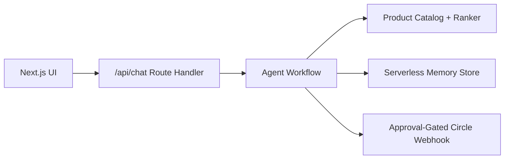

# GenPark Social Shopping Agent


UCWS Singapore Hackathon 2026 Agent Track submission.

This is not a shopping chatbot. It is a social shopping operator that turns intent into a saved shortlist and an approval-gated community post.

GenPark Social Shopping Agent turns a shopping intent into an executable social-shopping workflow: it parses budget and needs, searches a product catalog, ranks candidates, saves a shortlist, drafts a Circle social handoff, and waits for explicit confirmation before any publishing side effect.

## Judge Quick Start

- Submission brief: [SUBMISSION.md](SUBMISSION.md)
- Demo screenshot: [docs/demo-screenshot.png](docs/demo-screenshot.png)
- Local demo: `npm install`, `npm run dev`, open `http://localhost:3000`
- Best demo prompt is prefilled in the UI

## Why This Is An Agent

- Goal-directed workflow: shopping need -> shortlist -> saved collection -> approval-gated Circle handoff.
- Tool use: search, ranking, collection persistence, Circle draft handoff, and optional publishing webhook.
- Memory: the Vercel demo keeps per-session pending approvals, collections, posts, and traces in serverless memory.
- Safety: the community post remains a draft until `confirm post`; missing Circle publishing setup returns `drafted_requires_setup` instead of fake success.
- Evaluability: every response includes the plan, tool calls, products, constraints, draft, and pending action.

## Demo Flow

Use this prompt:

```text
Find a work-from-home gift under $220 and draft a Circle post asking friends to choose.
```

Expected behavior:

1. The agent extracts the budget.
2. It searches and ranks products.
3. It saves the top candidates to the demo collection.
4. It drafts a Circle post.
5. It waits for `confirm post` before any publish attempt.

If no Circle publishing webhook is configured, the confirmed handoff is saved as an approved draft with `drafted_requires_setup`. This is intentional: the project does not claim a real side effect happened unless it did.

## Run Locally

```bash
npm install
npm run dev
```

Open [http://localhost:3000](http://localhost:3000).

For API-only usage:

```bash
curl -X POST http://localhost:3000/api/chat \
  -H "Content-Type: application/json" \
  -d '{"user_id":"demo","session_id":"demo-1","message":"Recommend smart home products under $160 and draft a Circle post"}'
```

## Deploy On Vercel

1. Import `https://github.com/Alpha-Park/ucws-hackathon-agent` into Vercel.
2. Keep the framework preset as `Next.js`.
3. Use the default install command `npm install`.
4. Use the default build command `npm run build`.
5. Deploy. Vercel will produce the public demo URL.

Optional environment variable:

- `GENPARK_CIRCLE_WEBHOOK_URL`: if provided, approved Circle drafts are sent to that webhook. Without it, the demo records approved drafts without faking a publish.

## API Response Shape

`POST /api/chat` returns:

- `answer`: human-readable agent response
- `plan`: ordered workflow steps
- `tool_calls`: auditable tool trace
- `products`: ranked product shortlist
- `collection`: saved items for the user
- `draft_post`: proposed Circle post
- `pending_action`: action requiring user confirmation
- `next_action`: next instruction for the user

## Architecture



The deterministic workflow powers the hackathon demo so judges can run the product without private API keys. The hosted demo is optimized for public Vercel deployment; production persistence should use a database such as Vercel Postgres, Neon, Supabase, or Upstash.

## Project Structure

```text
app/
  page.jsx                Next.js UI
  api/chat/route.js       Agent API endpoint
  api/collection/route.js Collection endpoint
  api/health/route.js     Runtime health endpoint
lib/
  agent.js                Shopping-agent workflow orchestration
  catalog.js              Intent parsing, budget inference, ranking
  products.js             Deterministic demo catalog
  store.js                Serverless in-memory sessions and traces
tests/
  agent.test.mjs          Workflow tests
```

## Tech Stack

- Next.js
- React
- Vercel
- JavaScript
- API Routes
- Serverless
- Agent Workflow

## Tests

```bash
npm test
npm run build
```

## Current Limitations

- Product data is a deterministic local catalog for reproducible judging.
- Hosted demo memory can reset on serverless cold starts; production should use a durable database.
- Circle handoff is demo-safe by default: it drafts and records the approved post, while optional publishing uses `GENPARK_CIRCLE_WEBHOOK_URL`.
- Image attachment for Circle drafts is not implemented yet.
- For production, replace the catalog with a real GenPark API/search index and move auth behind a proper user session.
