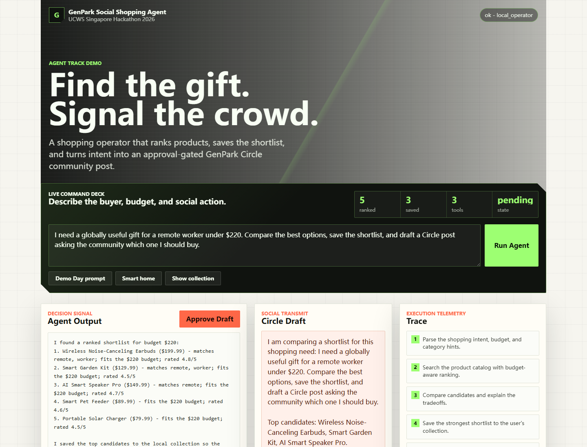
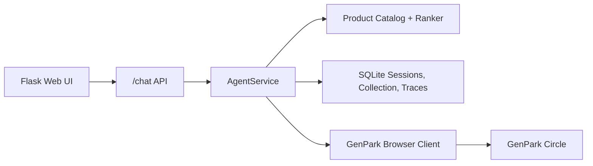

# GenPark Social Shopping Agent



UCWS Singapore Hackathon 2026 Agent Track submission.

This is not a shopping chatbot. It is a social shopping operator that turns intent into a saved shortlist and an approval-gated community post.

GenPark Social Shopping Agent turns a shopping intent into an executable social-shopping workflow: it parses budget and needs, searches a product catalog, ranks candidates, saves a shortlist, drafts a Circle social handoff, and waits for explicit confirmation before any publishing side effect.

## Why This Is An Agent

- Goal-directed workflow: shopping need -> shortlist -> saved collection -> approval-gated Circle handoff.
- Tool use: search, ranking, collection persistence, Circle draft handoff, and optional publishing.
- Memory: per-user collection and pending approval state are stored in SQLite.
- Safety: the community post remains a draft until `confirm post`; missing GenPark browser setup returns `requires_setup` instead of fake success.
- Evaluability: every response includes the plan, tool calls, products, constraints, draft, and pending action.

## Demo Flow

Use this prompt:

```text
Find a work-from-home gift under $220 and draft a Circle post asking friends to choose.
```

Expected behavior:

1. The agent extracts the budget.
2. It searches and ranks products.
3. It saves the top candidates to the local collection.
4. It drafts a Circle post.
5. It waits for `confirm post` before any publish attempt.

If GenPark credentials or Playwright are not configured, the confirmed handoff is saved as an approved draft with `drafted_requires_setup`. This is intentional: the project does not claim a real side effect happened unless it did.

## Run Locally

```bash
python -m venv .venv
.venv\Scripts\activate
pip install -r requirements.txt
python -m playwright install chromium
copy .env.example .env
python -m bot.app
```

Open [http://127.0.0.1:3000](http://127.0.0.1:3000).

For API-only usage:

```bash
curl -X POST http://127.0.0.1:3000/chat ^
  -H "Content-Type: application/json" ^
  -d "{\"user_id\":\"demo\",\"session_id\":\"demo-1\",\"message\":\"Recommend smart home products under $160 and draft a Circle post\"}"
```

## API Response Shape

`POST /chat` returns:

- `answer`: human-readable agent response
- `plan`: ordered workflow steps
- `tool_calls`: auditable tool trace
- `products`: ranked product shortlist
- `collection`: local saved items for the user
- `draft_post`: proposed Circle post
- `pending_action`: action requiring user confirmation
- `next_action`: next instruction for the user

## Architecture



The deterministic `AgentService` powers the hackathon demo so judges can run the workflow without private API keys. `bot/agent.py` also exposes an optional Google ADK `root_agent` using the same tools when ADK and Google credentials are configured.

## Project Structure

```text
bot/
  app.py                  Flask API and web UI entrypoint
  services.py             Shopping-agent workflow orchestration
  catalog.py              Product parsing, budget inference, ranking
  store.py                SQLite persistence for sessions and traces
  agent.py                Optional Google ADK agent definition
  tools/                  Search, recommendation, collection, Circle tools
  browser/genpark_client.py
  templates/index.html
  static/
```

## Environment

Copy `.env.example` to `.env`.

- `GOOGLE_API_KEY`: needed only for Google ADK runtime usage.
- `GENPARK_EMAIL` and `GENPARK_PASSWORD`: needed only for optional browser-based Circle publishing after approval.
- `GENPARK_AGENT_DB`: optional SQLite path.

## Tests

```bash
python -m unittest discover -s tests
```

## Current Limitations

- Product data is a deterministic local catalog for reproducible judging.
- Product images use public product-lifestyle imagery until a real GenPark catalog feed is connected.
- Circle handoff is demo-safe by default: it drafts and records the approved post, while optional publishing uses browser automation and depends on GenPark UI stability.
- Image attachment for Circle drafts is not implemented yet.
- For production, replace the catalog with a real GenPark API/search index and move auth behind a proper user session.
